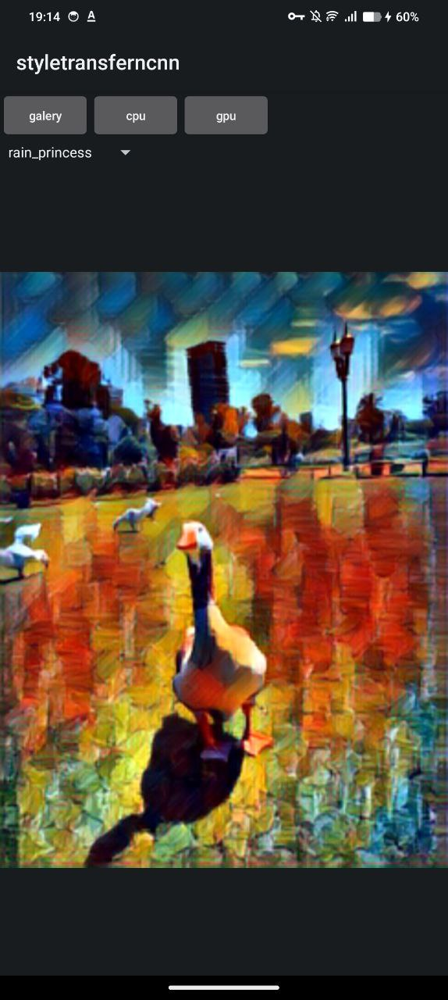
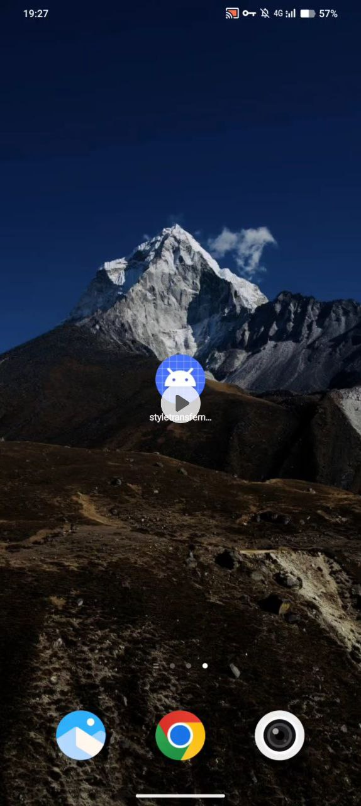

# StyleTransfer Mobile App

## Описание

Данный учебный проект посвящён разработке мобильного приложения для переноса стиля на изображения, 
аналогичного приложению Prisma. Проект включает в себя обучение модели машинного обучения для переноса стиля, 
её оптимизацию и интеграцию в мобильное приложение на платформе Android с использованием TensorFlow Lite. 
Все вычисления модели проводятся непосредственно на устройстве, что позволяет избежать затрат на сервера и обеспечивает высокую производительность приложения.

## Содержание

- [Видео Демонстрация](#видео-демонстрация)
- [Примеры Инференса](#примеры-инференса)

### Результат переноса стиля

Окончательный результат переноса стиля, демонстрирующий преобразованное изображение с выбранным художественным стилем.

## Видео Демонстрация

Окончательный результат переноса стиля, демонстрирующий преобразованное изображение с выбранным художественным стилем.

> **Примечание:** Убедитесь, что все скриншоты добавлены в папку `screenshots` вашего репозитория и пути к изображениям указаны корректно. 
> Замените примеры изображений на реальные скриншоты вашего приложения.
